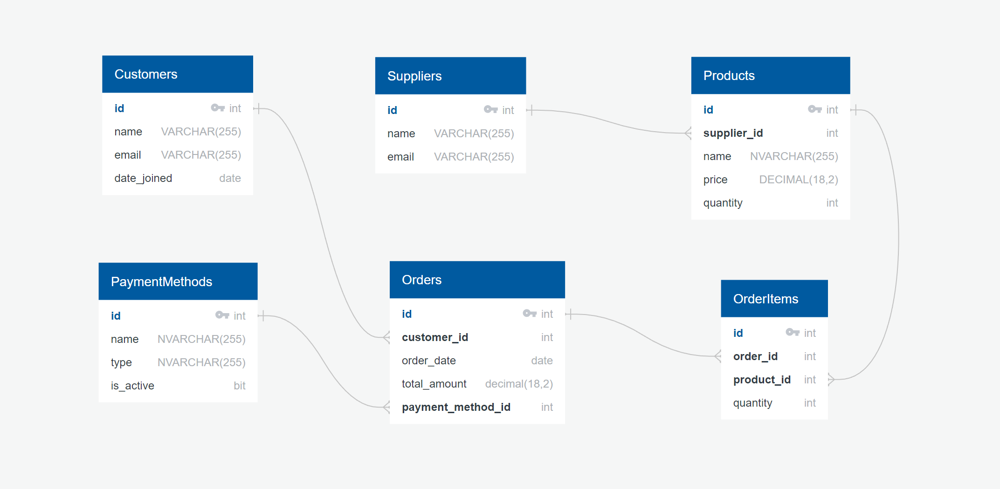
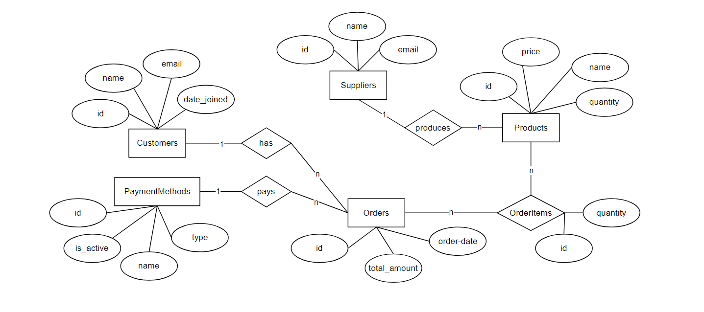

<p align="center">
   
</p>
<h1 align="center">
   M153 Project
</h1>
<p align="center">
   Pino Scheiblechner, Yannic Studer </br> Thema: Kiosk Datenbank
</p>

## Order description
Go to [description](./README.md)

## Introduction 

This database is for a kiosk store and contains several tables to store information about the store's operations.

### Description of the tables

The Suppliers table stores information about the suppliers of the kiosk store, including the supplier's name and email address.
The Products table stores information about the products sold at the kiosk store, including the product's name, price, quantity available, and the supplier of the product.
The Customers table stores information about the customers of the kiosk store, including the customer's name, email address, and the date they first visited the kiosk store.
The PaymentMethods table stores information about the payment methods used at the kiosk store, including the payment method's name, type, and whether it is currently active or not.
The Orders table stores information about the orders placed at the kiosk store, including the order date, total amount, payment method used, and the customer who placed the order.
The OrderItems table stores information about the items in each order, including the quantity of the item, the order it belongs to, and the product being ordered.

## Relational Model

<p align="center">
   
</p>

The database has several tables that store information about the kiosk store. The Suppliers table stores information about the suppliers of the kiosk store, including their names and email addresses. The Products table stores information about the products sold at the kiosk store, including their names, prices, quantities available, and the suppliers of the products. The Customers table stores information about the customers of the kiosk store, including their names, email addresses, and the dates they first visited the kiosk store. The PaymentMethods table stores information about the payment methods used at the kiosk store, including their names, types, and whether they are currently active or not. The Orders table stores information about the orders placed at the kiosk store, including the order dates, total amounts, payment methods used, and the customers who placed the orders. Finally, the OrderItems table stores information about the items in each order, including the quantities of the items, the orders they belong to, and the products being ordered. The tables are related through foreign keys that establish one-to-many and many-to-one relationships between the tables.

## Entity–Relationship Model

<p align="center">
   
</p>

The database has several entities, or tables, that store information about the kiosk store and its operations. These entities include Suppliers, Products, Customers, PaymentMethods, Orders, and OrderItems.

- The Suppliers entity has a one-to-many relationship with the Products entity, as each supplier can provide multiple products. The Products entity has a many-to-one relationship with the Suppliers entity, as each product can only be supplied by one supplier.
- The Customers entity has a one-to-many relationship with the Orders entity, as each customer can place multiple orders. The Orders entity has a many-to-one relationship with the Customers entity, as each order can only be placed by one customer.
- The PaymentMethods entity has a one-to-many relationship with the Orders entity, as each payment method can be used for multiple orders. The Orders entity has a many-to-one relationship with the PaymentMethods entity, as each order can only use one payment method.
- The Orders entity has a one-to-many relationship with the OrderItems entity, as each order can contain multiple items. The OrderItems entity has a many-to-one relationship with the Orders entity, as each item can only belong to one order.
- The Products entity has a one-to-many relationship with the OrderItems entity, as each product can be included in multiple orders. The OrderItems entity has a many-to-one relationship with the Products entity, as each item can only be a product.

## Description of queries, manipulations and tests

### calculate_customer_expenses

```

CREATE OR ALTER FUNCTION calculate_customer_expenses(@customerid INT)
RETURNS DECIMAL AS
BEGIN
	DECLARE @totalrevenue INT
	SELECT @totalrevenue = SUM(total_amount)
		FROM Orders WHERE customer_id = @customerid
	RETURN(@totalrevenue)
END


--Test


SELECT dbo.calculate_customer_expenses(id)
AS Total_expenses_all_Sam_smiths 
FROM Customers WHERE name = 'Sam smith'
SELECT TOP 1 dbo.calculate_customer_expenses(id)
AS Total_expenses_Sam_Smith 
FROM Customers WHERE name = 'Sam smith'
```

The first SELECT statement selects the result of the function for all customers with the name "Sam Smith" from the Customers table and returns it as a column called "Total_expenses_all_Sam_smiths". The WHERE clause filters the rows in the Customers table to only include those with the name "Sam Smith".

The second SELECT statement is similar to the first, but it uses the TOP 1 clause to only select the first row that matches the WHERE clause. This returns the result of the function for only one customer with the name "Sam Smith" and returns it as a column called "Total_expenses_Sam_Smith".

### update_total_amount

```
CREATE TRIGGER update_total_amount
ON OrderItems
AFTER INSERT, UPDATE
AS
BEGIN
    UPDATE o
    SET o.total_amount = (SELECT SUM(oi.quantity * p.price)
                         FROM OrderItems oi
                         INNER JOIN Products p ON oi.product_id = p.id
                         WHERE oi.order_id = o.id)
    FROM Orders o
    WHERE o.id IN (SELECT order_id FROM inserted)
END

--Test

INSERT INTO Orders (customer_id, order_date, payment_method_id)
VALUES (9, '2022-01-19', 1);
GO
SELECT * FROM Orders
GO
INSERT INTO OrderItems (order_id, product_id, quantity)
VALUES (9, 11, 1);
GO
SELECT * FROM Orders
```

The test first inserts a new order into the Orders table with a customer id of 9, an order date of '2022-01-19', and a payment method id of 1. The test then selects all rows from the Orders table to verify that the insertion was successful.

Next, the test inserts a new order item into the OrderItems table with an order id of 9, a product id of 11, and a quantity of 1. The test then selects all rows from the Orders table again to verify that the trigger has correctly updated the total amount for the order based on the new order item.


### restock_items

```
CREATE PROCEDURE restock_items
AS  
BEGIN  
	UPDATE Products
	SET	quantity = 100
	WHERE Products.quantity < 100 
END

--Test

SELECT * FROM Products WHERE quantity < 100
GO
EXEC restockItems
GO
SELECT * FROM Products
GO
```

The first SELECT statement selects all rows from the Products table where the quantity is less than 100. This is likely to verify that there are products with a quantity less than 100 before the stored procedure is executed.

The EXEC statement then executes the stored procedure, which updates the quantity of the applicable products in the Products table to be 100.

The second SELECT statement then selects all rows from the Products table to verify that the stored procedure has correctly updated the quantity of the applicable products. This can help ensure that the stored procedure is correctly identifying and updating the quantity of the products in the Products table.